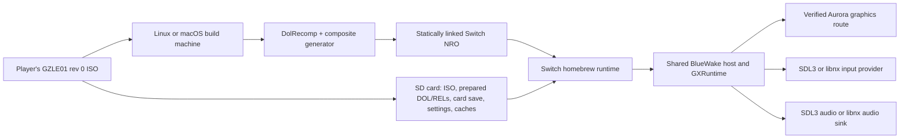

# Unofficial Nintendo Switch Homebrew Port — Engineering Plan

**Status:** Proposed; diagnostic and standalone Dawn offscreen NROs cross-build; bootstrap SD detection and an SDL2/Mesa GLES texture draw are physically confirmed, but Dawn runtime, Aurora/GX, and game rendering remain unverified  
**Plan date:** 2026-10-01  
**Target:** A native homebrew `.nro` build of Wind Waker Recomp, built from this repository and the player's own supported disc

> **Implementation checkpoint (2026-10-02):** The bootstrap log confirms SD availability, log
> creation, and clean stop. The SDL2/Mesa log reports OpenGL ES 3.2, Mesa `NV120`, a 1280×720
> drawable with 16 depth bits, and a passed framebuffer color copy. The two logged runs lasted only
> 2–4 seconds; a 10-minute soak and an actual depth-occlusion pixel test remain unverified. A Dawn
> offscreen NRO cross-builds; hardware logs report EGL 1.4/surfaceless, no robust-context or any
> EGL sync extension, and no pbuffer config. Dawn rejected adapter discovery before rendering.
> The latest diagnostic build logs these capabilities, disables robust buffer access only for its
> fixed test shader if required, and synchronously drains GL work with `glFinish` when EGL sync is
> unavailable. This is slow, does not support shared-fence export, and is **not production-safe**;
> its physical rerun is pending. Aurora
> configuration still stops in SDL3's unsupported Switch platform/thread detection, and Dawn/Aurora
> have no libnx `NWindow` surface path. The offscreen Dawn experiment does not pass Gate A. See the
> [graphics feasibility record](status/SWITCH_GRAPHICS_SPIKE.md) and
> [Dawn probe notes](../switch/dawn/README.md). Do not start static game-composite or host integration
> until the physical-device Aurora/GX graphics gate passes.

## Executive summary

This project already has a native static-recompilation pipeline: DolRecomp translates the GZLE01 executable and REL modules to host C, the composite generator assembles them, and the runtime executes the result with a GameCube compatibility layer. The iOS build demonstrates that the host and generated code can target arm64, but it is still an Apple build: it uses an iOS SDK, a Mach-O dynamic module, an iOS app shell, and a Dawn/Aurora renderer configured for Apple.

A Switch port is therefore not just another compiler target. It needs four proofs before broad implementation:

1. **Graphics feasibility:** Aurora currently reaches the GPU through Dawn/WebGPU. The project has no established Switch Dawn package or Switch Aurora backend. A real GX shader, texture, depth operation, EFB copy, and present must work on a development console before gameplay porting proceeds.
2. **Executable format and module loading:** the current host loads a `.dylib` using `dlopen`/`dlsym`. A Switch `.nro` should statically link the recompiled composite and use an explicit function table instead.
3. **Horizon platform services:** input, audio output, display lifecycle, timing, storage, and logging need a supported homebrew implementation. The iOS Objective-C/UIKit shell cannot be reused.
4. **Performance and memory:** the game is CPU-bound in busy scenes on existing targets. Switch performance, executable size, application heap, graphics memory, and thermals must be measured on hardware; iPad results do not predict Switch results.

**Critical path:** close the graphics feasibility spike first. Do not spend months porting the host or adding features while the renderer remains unproven. The initial product bar should be the original game at its native 30 retraces per second and full real-time speed, with output synchronized to the Switch display. Frame interpolation, save states, and feature parity follow only after that bar is met.

## 1. Scope and constraints

### Goals

- Build a reproducible Switch homebrew application from the pinned project sources and a user-supplied `GZLE01` revision 0 disc.
- Keep the existing static-recompilation architecture, translated-code ABI, guest timing model, game data checks, and memory-card behavior.
- Run on a lawfully homebrew-capable development console using public homebrew toolchains and libraries; do not depend on the commercial Nintendo SDK.
- Keep user data and build products outside tracked source. Support a clearly documented SD-card data directory.
- Preserve desktop and iOS builds. Switch-specific behavior must live behind a platform target or interface rather than destabilizing existing targets.
- Ship only what the repository's release policy permits, with exact source/dependency provenance and third-party notices.

### Non-goals for the first playable build

- Replacing the project with a conventional emulator or a new decompilation/port route.
- Runtime recompilation of the GameCube CPU code; the existing ahead-of-time translated composite remains the execution model.
- Supporting every compressed disc format. Start with a verified uncompressed ISO/GCM path; add formats only after the core build is stable.
- Reaching 60 rendered FPS through interpolation, 120 FPS, or parity with every Windows/Mac/iOS feature.
- Touch controls, mouse controls, online services, cloud saves, or an in-app content browser.
- Bundling game data or distributing tools, keys, firmware, exploits, or instructions that bypass console security. Installation assumes a console the user has already lawfully configured for homebrew.

## 2. Repository baseline to preserve

| Area | Current design | Switch implication |
|---|---|---|
| Game code | DolRecomp translates the DOL and 415 RELs; [scripts/generate_composite.py](../scripts/generate_composite.py) assembles a deterministic composite. The iOS build compiles it as a dynamic library. | Reuse the translator and generator, but cross-compile to Switch AArch64 and link the composite into the NRO. Do not check generated game code into the public source tree. |
| Runtime | The [host runtime](../runtime/host/CMakeLists.txt) owns guest scheduling, device models, saves, settings, and platform integration. [main.c](../runtime/host/src/main.c) loads the composite dynamically; mod and option exports are also looked up dynamically. | Introduce a composite-provider interface that can use `dlopen` on current platforms and direct function references on Switch. Audit every `dlsym` call, not just the initial module load. |
| Renderer | The documented route is Aurora GX over Dawn/WebGPU. Existing product targets are Direct3D 12 and Metal; the iOS configuration fetches a pinned iOS Dawn package. | Prove a supported Switch WebGPU route or approve a bounded Aurora backend project before attempting full game rendering. There is no assumed drop-in Switch renderer. |
| iOS shell | [apple/ios/CMakeLists.txt](../apple/ios/CMakeLists.txt) builds an Objective-C/Objective-C++ UIKit app, imports a disc through a first-run screen, and links Apple frameworks. | Reuse portable game/runtime pieces only. Add a separate homebrew entry point, SD-card first-run flow, and platform services. |
| Disc/data | [apple/ios/src/disc_import.c](../apple/ios/src/disc_import.c) validates the disc ID and DOL SHA-1, extracts `main.dol` and RELs, and patches the extracted REL alignment field. It currently depends on CommonCrypto. Runtime also needs the disc image for assets. | Extract the importer into portable code and replace the Apple digest dependency with a small platform-neutral digest interface. Verify the same disc revision and expected 415 RELs on Switch. |
| Input | The host uses SDL3 gamepads/events and Aurora's PAD integration; camera, jump, and sprint helpers also read SDL3. | Select one supported path for Pro Controller and paired Joy-Cons. Establish a single mapping into the existing GameCube PAD API; do not create a second competing input path. |
| Audio | The DSP adapter is based on pinned RecompCore/Dolphin sources; Aurora's output queue is SDL-based on current targets. The iOS build adds donor DSP sources and Apple framework links. | Confirm SDL audio support on the selected Switch stack. If unavailable, implement a small Horizon audio sink behind the existing Aurora/audio boundary; keep DSP emulation itself independent of the sink. |
| Saves/settings | Memory-card persistence is path-based. macOS settings default to Application Support; iOS supplies paths in its app container. | Establish one stable SD data root and pass explicit paths to the existing host services. Use atomic writes and do not store saves beside replaceable executable files. |
| Dependencies | Exact pins are tracked in [config/dependencies.lock.json](../config/dependencies.lock.json); the current builder profile records RecompCore and DolRecomp revisions. | Add exact versions/checksums for the Switch toolchain, SDL/renderer packages, and any additional runtime libraries. Never float a dependency in a release build. |

Relevant implementation references: [README](../README.md), [device build](status/DEVICE_BUILD.md), [The Builder](BUILDER.md), [dependencies](../config/dependencies.lock.json), [Aurora assessment](research/AURORA.md), [rights and licenses](../RIGHTS_AND_LICENSES.md), and the repository [agent/release instructions](../AGENTS.md). The Aurora assessment is historical research; re-audit the exact locked revision before relying on it.

## 3. Proposed architecture

### Build-time flow

1. The build machine validates the player's GZLE01 revision 0 disc.
2. It extracts the DOL and RELs into an ignored build directory, runs the pinned DolRecomp and [composite generator](../scripts/generate_composite.py), and checks the generated-source digest.
3. It compiles translated code for the Switch AArch64 ABI and links it statically into the host executable.
4. It packages an `.nro` plus a machine-readable provenance record. The disc image, extracted files, saves, generated source, and private training data remain outside the release package.

### First-run/device flow

1. The player copies their own uncompressed ISO/GCM to the documented SD-card data directory.
2. The app checks the disc ID and executable hash, extracts `main.dol` and 415 RELs to a temporary directory, verifies the result, then atomically publishes the prepared files.
3. The runtime reads game assets from the player's ISO, keeps the memory card and settings in the data directory, and fails with a useful on-screen/logged error if any required input is missing.

The NRO and the runtime data directory must remain separate. Updates must not overwrite the card save, settings, logs, or user-provided ISO.

## 4. Feasibility gates and technical decisions

### Gate A — graphics proof (must close before full host port)

Audit the exact Aurora, Dawn, SDL3, and devkitPro versions intended for use. Build the smallest homebrew renderer experiment that can:

- create and present a surface in handheld mode and survive display/lifecycle changes;
- compile and execute a shader generated by Aurora's GX path, including texture sampling and alpha blending;
- exercise depth testing and the color/depth copy behavior needed by the game;
- submit work asynchronously with correct fences/resource lifetimes;
- run for at least 10 minutes without device loss, unbounded cache growth, or rendering corruption.

Test, in order:

1. Whether a reproducible Dawn/WebGPU build and a compatible surface/backend exist for the chosen homebrew toolchain.
2. If Dawn can use an available GLES/OpenGL stack, whether Aurora's required WebGPU features and dynamic pipeline creation work on the actual console at acceptable performance.
3. Only if the above fail, estimate a dedicated Aurora-to-deko3d backend. This is a separate renderer project: deko3d is a low-level Switch homebrew API, not a WebGPU implementation, and its documented shader workflow is compile-time oriented. Aurora's GX state can produce runtime shader variants, so a shader translation/compilation and pipeline-cache strategy must be proven, not assumed.

**Pass condition:** render a GXCore/Aurora-generated textured draw with correct depth/blend, perform an EFB copy, and present it on physical hardware through the intended application path. Produce a short design note with measured CPU/GPU timings, unsupported WebGPU features, shader strategy, package pins, and a go/no-go decision.

**Stop condition:** if no public, reproducible graphics path passes this test without an unbounded shader rewrite, proprietary SDK dependency, or unsupported runtime, stop the port and present options for maintainer review. A blank window or a hand-written demo shader is not evidence that the Wind Waker renderer works.

### Gate B — target ABI, executable and memory proof

- Confirm the selected homebrew toolchain's AArch64 ABI, C/C++ runtime, threading, filesystem, shared-memory, and linker behavior.
- Compile a small generated composite fixture for the NRO target and call its entry through a static function table.
- Measure compile time, link time, NRO size, relocation count, static RAM, heap use, and startup time with release compiler options.
- Confirm the `CPUState` and StaticRecomp ABI checks still match and that translated floating-point/paired-single behavior passes existing guest/runtime tests.
- Record a tested application-memory ceiling and keep a minimum 15% headroom in the heaviest measured route. If this cannot be met, reduce cache/resource budgets or stop before feature work.

### Gate C — input, audio, storage, and lifecycle proof

- Confirm Pro Controller and paired Joy-Con connect/disconnect behavior and reliable left/right stick/button sampling.
- Produce stable stereo audio through the selected output path, with queue depth and underruns observable in logs.
- Read a large ISO from SD, create/replace a temporary file atomically, and preserve data across process exit/relaunch.
- Handle applet exit, suspend/resume, controller loss, and renderer/audio restart without advancing the guest while the application is suspended.

## 5. Implementation phases

### Phase 0 — evidence and toolchain spike

**Deliverables**

- A reproducible devkitPro/libnx toolchain container or documented host setup, with exact versions and checksums.
- A minimal NRO that starts, logs to a file, reads SD storage, samples a controller, opens the chosen audio output, and presents a clear frame.
- The Gate A renderer experiment and decision note.
- A dependency/provenance update; no game data or generated composite in tracked files.

**Progress:** The diagnostic launch/display/SD/log probe is implemented in
[switch/source/main.c](../switch/source/main.c), built by
[scripts/switch/build_probe.sh](../scripts/switch/build_probe.sh), and has compiled to an NRO. A
separate [SDL2/Mesa GLES probe](../switch/source/gles/gles_probe.c), built by
[scripts/switch/build_gles_probe.sh](../scripts/switch/build_gles_probe.sh), exercises shader compile,
texturing, blend/depth state, and a framebuffer color copy. The supplied bootstrap log confirms
`sd_available=1`, `log_ready=1`, and clean stop. The GLES logs report ES 3.2 on Mesa `NV120`, a
1280×720 surface with 16 depth bits, and successful framebuffer color copy. The reported runs were
only 2–4 seconds; a 10-minute soak and a Dawn depth-occlusion pixel check remain untested. A separate pinned-Dawn
[offscreen OpenGLES probe](../switch/dawn/README.md), built by
[scripts/switch/build_dawn_probe.sh](../scripts/switch/build_dawn_probe.sh), now cross-compiles to
an NRO that renders a WGSL textured pass, checks blend/depth through GPU readback, and presents via
the libnx framebuffer. Console logs report EGL 1.4, surfaceless context, no robust-context support,
no EGL fence/reusable/native fence extension, and no pbuffer config. Dawn rejected adapter
discovery before rendering. The rebuilt diagnostic uses robust buffer access only when EGL allows
it and drains each queue serial synchronously with `glFinish` if EGL has no sync extension. This
slow fallback does not support shared-fence export and is not production-safe; that NRO still needs
a physical rerun. This is Dawn+GLES
evidence only, not an
Aurora/GX render or a Dawn Switch-window surface. Pinned Aurora configuration still stops in SDL3's
unsupported-platform thread detection; SDL3 platform work and Dawn/NWindow surface integration
remain blockers. Do not start game-composite integration based on these probes.

**Acceptance**

- A clean checkout can build the minimal NRO in CI or a documented clean environment.
- The experiment runs on at least one physical development console. An emulator-only result does not close the gate.
- Gate A passes before any game-specific renderer integration begins.

### Phase 1 — static composite and build target

**Code areas**

- Add a Switch application target in a new Switch-specific directory and a dedicated CMake toolchain/build entry point.
- Extend [cmake/composite/CMakeLists.txt](../cmake/composite/CMakeLists.txt) to expose translated sources as an OBJECT or STATIC target in addition to the existing shared-library target. Preserve current desktop/iOS linkage.
- Add a `BlueWakeCompositeAPI` provider interface. It should cover all exports the host currently obtains dynamically, including module metadata, REL data/aliases, mod application, option tables/hooks, memory-write journal, and edge-service registration.
- Keep a dynamic provider for macOS/iOS/Windows where used; use direct symbols for the Switch provider. Remove `dlfcn.h` from the Switch compilation path rather than emulating `dlopen`.
- Add a synthetic link test proving that the NRO retains all required composite exports and code ranges after dead stripping.

**Acceptance**

- The Switch build links one NRO with no `.dylib`/`.so` sidecar.
- ABI checks pass; all 415 REL module descriptors and expected code ranges are present.
- Existing desktop runtime tests and current platform builds remain unchanged.
- Build outputs, translated code, and logs live under an ignored Switch build directory.

### Phase 2 — shared host/platform boundary

**Code areas**

- Create a narrow platform interface for initialization/shutdown, monotonic time, sleeping/pacing, thread naming/creation where required, app lifecycle, storage paths, logging, input, audio output, and renderer surface access.
- Keep guest cycle accounting and scheduling deterministic. Translate Switch wall-clock/suspend events into explicit host lifecycle events; never let a suspended console silently accumulate guest time.
- Pass explicit paths from the Switch entry point (`BLUEWAKE_DOL`, `BLUEWAKE_RELS_DIR`, `BLUEWAKE_DISC`, `BLUEWAKE_CARD_PATH`, settings/cache/state directories) instead of relying on `HOME`, a current working directory, or an Apple bundle path.
- Keep Switch-specific sources out of the [host entry point](../runtime/host/src/main.c) where a small service interface or compile-time provider is sufficient.

**Initial SD layout**

- `sdmc:/switch/wind-waker-recomp/GZLE01.iso`
- `sdmc:/switch/wind-waker-recomp/main.dol`
- `sdmc:/switch/wind-waker-recomp/rels/`
- `sdmc:/switch/wind-waker-recomp/GZLE01.card`
- `sdmc:/switch/wind-waker-recomp/settings.ini`
- `sdmc:/switch/wind-waker-recomp/logs/`, `states/`, and renderer cache directories as they become supported

Use a temporary import directory and rename only after all disc checks and output validation succeed. Preserve existing user files on failure or update.

**Acceptance**

- The existing `card_runtime` can create, save, close, and reopen a card at the Switch path; a guest save survives an NRO replacement.
- Settings/cache/log writes stay under the data root and survive normal exit/relaunch.
- App suspend/resume pauses and resumes the guest cleanly; no detached worker accesses a closed renderer/audio device.

### Phase 3 — disc validation and first-run UX

**Code areas**

- Move the reusable parsing/extraction portion of [apple/ios/src/disc_import.c](../apple/ios/src/disc_import.c) into a platform-neutral library; replace `CommonCrypto` with a digest provider that has identical SHA-1 results on macOS, iOS, Linux, and Switch.
- Keep the existing exact `GZLE01` disc ID and revision-0 DOL hash checks. Validate malformed offsets, allocation limits, REL count, and the extracted alignment patch with public synthetic fixtures.
- Add a Switch-friendly first-run view/status screen. Initial UX can use simple controller navigation and fixed SD paths; do not block MVP on a file picker.
- Start with ISO/GCM only. RVZ/WIA/GCZ and external texture packs are later opt-ins, not silent runtime dependencies.

**Acceptance**

- Supported disc prepares successfully on device; wrong game, wrong revision, truncated ISO, malformed FST/RARC/Yaz0, and insufficient storage fail without leaving partially published files.
- Exactly 415 expected RELs are present, and prepared DOL/REL checks match the existing builder's output.
- The user can identify the missing/wrong input from the display or session log without a debugger.

### Phase 4 — renderer, controls, and audio integration

**Graphics**

- Implement only the backend/surface path approved by Gate A. Keep Aurora's GX front end and game-facing API unchanged where possible.
- Add device-loss/recreate handling, bounded pipeline and texture caches, resolution selection, and a cache-clear path.
- Build a private test corpus from user-provided game data; compare title, file select, Outset, menus, sea, and a busy scene. Do not commit captured copyrighted frames or game-derived assets.
- Begin at native 4:3 output and conservative internal resolution. Add widescreen, texture packs, and higher render scale after fidelity/performance tests.

**Controls**

- Map Pro Controller and paired Joy-Cons to one GameCube PAD source with calibrated dead zones and repeatable analog ranges.
- Document Switch face-button labels explicitly; provide a remapping/settings path rather than assuming Xbox or GameCube labels match the printed buttons.
- Add a controller-accessible pause/settings action. Keyboard-only shortcuts (F1/F5/F9/F10/F11) cannot be the sole UI path.
- Treat single Joy-Con, HD rumble, and advanced gyro mapping as later scope unless the homebrew input stack makes them low risk.

**Audio**

- Prefer SDL's supported output path if the exact pinned SDL3 port exposes a real Switch audio device. Otherwise implement an `AudioSink` backed by the supported public Horizon audio service and keep it separate from DSP/HLE code.
- Preserve the project's 32/48 kHz stereo formats and bounded queue policy; measure queue latency, underruns, drops, and synchronization to VI/presentation.
- Exercise boot sounds, streamed music, scene transitions, DSP interrupts, suspend/resume, and long playback. A successful DSP boot handshake is not audio acceptance; audible output and queue health are required.

**Acceptance**

- A real translated game frame is displayed, not only a renderer test scene.
- Pro Controller and paired Joy-Cons control Link through title/file select and a test route; disconnect/reconnect is safe.
- Music and effects are audible in stereo; no recurring underruns during a 30-minute test at full game speed.

### Phase 5 — playable MVP and performance qualification

**MVP feature set**

- Disc check/import, game boot, title/file select, controllable gameplay on Outset, normal memory-card saves, controller controls, stereo audio, a pause/resume path, settings for resolution/aspect/volume if supported, and session logs.
- The player supplies the disc image on SD. No game assets, DOL/REL files, or disc data are bundled in the NRO/package.
- Existing project modifications may be enabled only when their generated composite is produced from the supported disc and their Switch path passes the same acceptance tests.

**Performance campaign**

1. Establish an unoptimized Switch baseline before PGO or micro-optimizations.
2. Measure wall-clock guest retraces, presented frames, p50/p95/p99 frame time, game-thread CPU, GX worker CPU, GPU wait, audio queue, heap use, and temperature/throttling.
3. Test boot/title, Outset idle/walk, a crowded/busy view, scene transition, and at least 30 minutes of play, handheld and docked if both are supported.
4. Set the first release target at **30 guest retraces per second at 100% real-time speed** in the declared minimum supported scene/device class. Record any busy-scene exception honestly. Target stable 60 Hz presentation only after the 30 Hz guest path has headroom.
5. Only after profiles and compiler support are proven, evaluate target-specific PGO. Do not assume the current Apple Clang `.profdata` files are usable with a GCC/devkitA64 toolchain. Keep any game-trained Switch profile private and generated from the player's own disc.

**Acceptance**

- Full-speed 30 Hz gameplay in the agreed baseline route, with no repeatable correctness divergence, dead input, or audio failure.
- No OOM, GPU/device loss, or save corruption in a 30-minute route and repeated scene transitions.
- Maintain at least 15% measured headroom within the configured application heap at the heaviest accepted route.
- Results identify hardware, OS/homebrew stack versions, build flags, route, thermal state, and test duration.

### Phase 6 — feature parity and hardening

After MVP acceptance, add and validate individually:

- Widescreen and Better Wind Waker variants.
- 60 Hz frame interpolation, if it maintains game speed and does not starve the CPU/GPU/audio queues.
- Save states, only after host, DSP, GX frontend, and renderer state are proven serializable on Switch.
- Quick doors, fast scene changes, jump/sprint, climbing, and controller settings.
- HD texture packs only if memory budgets, storage behavior, and licensing allow them.
- Robust shutdown, crash/session logs, cache management, and migration of settings/saves between releases.

Do not count a feature as ported because it compiles. Each feature needs a specific on-device acceptance case and a documented unsupported-state path.

### Phase 7 — release engineering

- Add an exact Switch dependency/toolchain manifest and emit a `BuilderProvenance.json` record with source revision, dependency pins, generated-composite digest, compiler/linker versions, build options, mod selection, and NRO SHA-256.
- Keep user ISO, extracted DOL/REL files, translated build intermediates, saves, logs with personal paths, and personal training data out of the release artifact.
- Run the repository public-asset audit and an explicit package scan before publishing. Include all third-party licenses/notices and install notes.
- Follow the repository's [AGENTS.md release instructions](../AGENTS.md): public compiled application builds are permitted under the project's existing model, but releases must never include the disc image, extracted game data/assets/textures, saves, memory cards, or personal settings.
- Describe the port as unofficial and independent; use no Nintendo logos or official-looking endorsement claims. Publish only after maintainer and license/provenance review.

## 6. Code change map

| Proposed area | Responsibility |
|---|---|
| New Switch application target and platform sources | NRO application target, startup, basic first-run UI, lifecycle and Switch service adapters. |
| CMake toolchain configuration or the toolchain file supplied by devkitPro | AArch64 compiler/sysroot configuration, reproducible linker flags, and CMake platform selection. |
| [cmake/composite/CMakeLists.txt](../cmake/composite/CMakeLists.txt) | Add static/object composite linkage without changing current shared-library builds. |
| New composite-provider interface and implementation | One explicit ABI boundary for module metadata, REL exports, mods/options, and optional host callbacks. |
| New host platform-service layer | Path, time, thread, audio, input, logging, and lifecycle interfaces/implementations. Keep target-specific code isolated. |
| New shared disc-import module | Portable disc verification/extraction and cross-platform digest provider. |
| Switch build script and helpers | Linux/macOS user-disc build pipeline, package audit, and provenance generation. Start separate from the Apple-specific Builder; factor common stages only after behavior is stable. |
| [config/dependencies.lock.json](../config/dependencies.lock.json) | Exact Switch SDK/library source revisions and archive checksums. |
| Existing tests | Static-provider ABI fixtures, importer fuzz/synthetic cases, path/card tests, and regression coverage for existing host builds. |

Names are provisional; the boundaries and acceptance conditions are the plan.

## 7. Main risks and mitigations

| Risk | Severity | Mitigation / decision |
|---|---:|---|
| No suitable Dawn/WebGPU or Aurora graphics path for Switch | Critical | Gate A first. Stop or obtain an explicit renderer-project decision; do not use a fake renderer milestone. |
| Runtime-generated GX shader variants do not fit the selected GPU API/toolchain | Critical | Prove Aurora-generated shader and pipeline behavior on device; separately cost any deko3d shader compiler/translation work. |
| Static NRO grows too large or link/relocation costs are unacceptable | High | Measure in Gate B, use object/static targets and link maps, and preserve an explicit size/startup budget before integrating all generated chunks. |
| Switch CPU cannot sustain 30 guest retraces/s | High | Measure native full-speed route early, optimize only measured owners, define supported scene/device class honestly, and stop if target cannot be met without guest-semantic changes. |
| Horizon APIs differ from POSIX/Apple assumptions | High | Keep adapters narrow, audit every platform include/API, and avoid a broad rewrite of guest/runtime logic. |
| SDL3 platform coverage is incomplete or inconsistent | High | Verify the exact SDL3 port and each subsystem. Fall back to a small direct libnx adapter only at documented interfaces. |
| Audio output timing changes guest delivery or drops buffers | High | Separate sink from DSP execution; monitor queue and interrupt timing; run deterministic headless tests plus physical audio tests. |
| SD import leaves partial files or corrupts a save | Medium | Temporary import directory, full validation, atomic rename, bounded allocations, and card backup/round-trip tests. |
| Cross-compiler changes translated code behavior | High | Keep route digests and CPU/runtime tests, compare Switch guest-state checkpoints with the accepted host route, and test compiler flags one at a time. |
| Build profiles/provenance accidentally expose personal data | Medium | Use ignored build directories, no game-trained profile in source, public-asset scan, artifact inspection, and release checklist. |

## 8. Test and release gates

A public beta is blocked until all of the following are true:

- [ ] Gate A graphics proof passes on physical hardware.
- [ ] A clean environment builds the pinned static composite and NRO with no private/generated inputs beyond the builder's own disc.
- [ ] Disc validation rejects wrong ID/revision and damaged images; import creates the expected DOL and REL set without partial publication.
- [ ] The game reaches controllable Outset gameplay with working Pro Controller and paired Joy-Con input.
- [ ] Stereo music/effects, guest saves, settings, suspend/resume, and cache persistence pass repeated tests.
- [ ] The declared performance target is met or the release notes state the measured limitation and supported device mode.
- [ ] A 30-minute soak has no crash, OOM, device loss, recurring audio underrun, or save corruption.
- [ ] Provenance, dependency pins, checksums, third-party notices, install notes, and package scan are complete.
- [ ] No disc image, extracted game files/assets/textures, save/card data, personal settings, or private profile data is present in the release.

## 9. Planning estimate

These are order-of-magnitude engineering estimates, not a release commitment. They assume an experienced C/C++ platform engineer, access to a physical development console, and no major upstream Dawn/Aurora integration surprises.

| Work | Initial estimate |
|---|---:|
| Phase 0 toolchain + renderer feasibility spike | 1–2 engineer-weeks |
| Static composite, provider ABI, and NRO link/package | 2–4 engineer-weeks |
| Storage/import, controls, audio, and lifecycle adapters | 3–6 engineer-weeks |
| Aurora/game renderer integration and first playable route, if Gate A passes on an existing stack | 4–10 engineer-weeks |
| Device performance, stability, and release qualification | 3–6 engineer-weeks |

The renderer estimate is conditional. A custom Aurora-to-deko3d implementation or new runtime GX shader compiler could add many months and requires a separate proposal. No calendar release date should be promised before Gate A and Gate B close.

## 10. References

- Project architecture and supported platforms: [README](../README.md)
- Reproducible device build and disc extraction: [device build](status/DEVICE_BUILD.md), [Build your own](BUILD_YOUR_OWN.md), [The Builder](BUILDER.md)
- Dependency provenance: [dependency lock](../config/dependencies.lock.json)
- Renderer evidence (historical; refresh at the pinned dependency): [Aurora assessment](research/AURORA.md)
- Licensing and game-data handling: [rights and licenses](../RIGHTS_AND_LICENSES.md), [release instructions](../AGENTS.md)
- Public homebrew graphics API information: [deko3d](https://github.com/devkitPro/deko3d)
- Homebrew toolchain package management: [devkitPro pacman](https://devkitpro.org/wiki/devkitPro_pacman)
